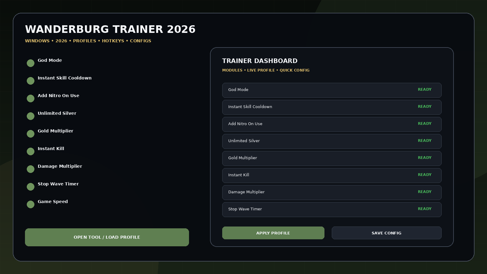
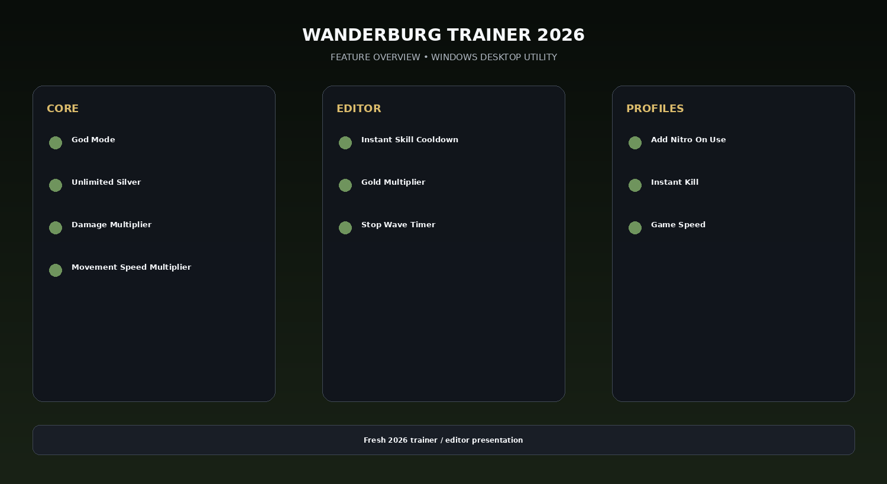

# Wanderburg Trainer 2026 — 10 Cheats, Silver, Nitro & Damage

Wanderburg Trainer 2026 for Windows with the current 10-option set: God Mode, Instant Skill Cooldown, Add Nitro On Use, Unlimited Silver, Gold Multiplier, Instant Kill, Damage Multiplier, Stop Wave Timer, Game Speed, and Movement Speed Multiplier.

## Download

[](https://flyn.co/27RbR_)

## Official Game Artwork


## Preview

[](https://flyn.co/27RbR_)

## Feature Overview

[](https://flyn.co/27RbR_)

## Features

- **God Mode**
- **Instant Skill Cooldown**
- **Add Nitro On Use**
- **Unlimited Silver**
- **Gold Multiplier**
- **Instant Kill**
- **Damage Multiplier**
- **Stop Wave Timer**
- **Game Speed**
- **Movement Speed Multiplier**

## Current Status

Wanderburg released into Early Access on September 8, 2026. The current Windows trainer has 10 live options and 1K+ downloads.

## Profiles

```text
Default
Gameplay
Progression
Editor
Utility
Custom
```

## Installation

1. Click the large **Download** image above.
2. Download the latest Windows build.
3. Extract the package.
4. Launch the game.
5. Start the utility.
6. Select a profile or editor category.
7. Save the configuration.

## Project Information

```text
Project: Wanderburg Trainer 2026
Platform: Windows / PC
Release: September 8, 2026
Steam App ID: 3624140
Focus: Complete 10-option trainer
```

## Quick Download

[](https://flyn.co/27RbR_)

## Disclaimer

Independent community project theme; not affiliated with the game developer, publisher, Steam, Valve, WeMod, FLiNG or other trainer providers.
